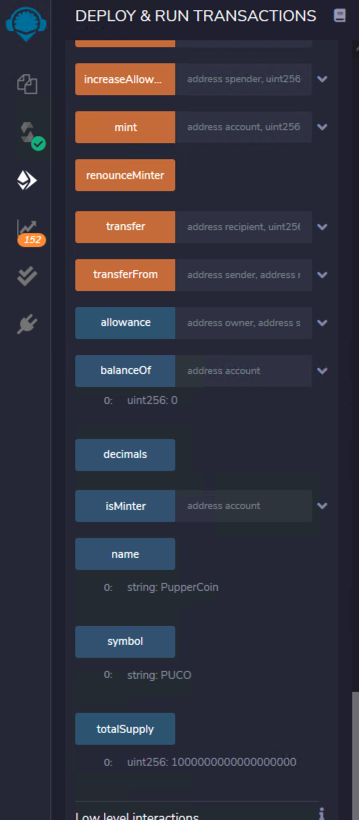

# fintech-advanced-solidity-homework

This repository contains contracts and transactions as part of the Fintech homework assignment Unit 21: You sure can attract a crowd!.

In this homework assignment, we crowdsale our PupperCoin token in order to help fund the network development. This network will be used to track the dog breeding activity across the globe in a decentralized way, and allow humans to track the genetic trail of their pets. We have created an ERC20 token that will be minted through a `Crowdsale` contract. We can leverage the `Crowdsale` contract from the [OpenZeppelin Solidity library](https://docs.openzeppelin.com/contracts/2.x/). This `Crowdsale` contract will manage the entire process, allowing users to send ETH and get back PUP (PupperCoin). This contract will mint the tokens automatically and distribute them to buyers in one transaction. It will need to inherit `Crowdsale`, `CappedCrowdsale`, `TimedCrowdsale`, `RefundableCrowdsale`, and `MintedCrowdsale`.

## Files

- [PupperCoin](PupperCoin.sol)

For this section, these are the following tasks:
    * navigate to the [Remix IDE](https://remix.ethereum.org/#optimize=false&runs=200&evmVersion=null&version=soljson-v0.8.4+commit.c7e474f2.js)
    * create a file `PupperCoin.sol`
    * create a standard `ERC20Mintable` token
    * design contract `ERC20 PupperCoin`
        * use `ERC20Mintable` and `ERC20Detailed` contract, hardcoding `18` as the decimals parameter, and the `initial_supply` parameter        
        

- [Crowdsale](Crowdsale.sol)

For this section, these are the following tasks:
    * create a file `Crowdsale.sol`
    * import `PupperCoin.sol`.
    * inherit the following OpenZeppelin contracts:
        * `Crowdsale`
        * `MintedCrowdsale`
        * `CappedCrowdsale`
        * `TimedCrowdsale`
        * `RefundablePostDeliveryCrowdsale`
    * provide parameters for all of the features of our crowdsale, such as the `name`, `symbol`, `wallet` for fundraising, `goal`, `open` and `close`
    * set `rate` of `1`, to maintain parity with Ether units (1 TKN per Ether, or 1 TKNbit per wei)
    * call the `RefundableCrowdsale` constructor from our `Crowdsale` constructor as `RefundablePostDeliveryCrowdsale` inherits the `RefundableCrowdsale` contract, which requires a `goal` parameter
    * use `now` and `now + 24 weeks` to set `open` and `close` times from our PupperCoinCrowdsaleDeployer contract    
    * deploy `PupperCoinCrowdsaleDeployer`
        * `Name` -- `PupperCoin`
        * `Symbol` -- `PUCO`
        * `Wallet` -- `0x8132DB002e21a53Ef2E1141b21d6A9EC3cEC2749`
        * `Goal` -- `3000000000000000000`
        
    
    * copy `token_sale_address` and paste in `address` tab
    * change `contract` to `PupperCoinSale`
    
    * copy `token_address`  and paste in `address` tab
    * change `contract` to `PupperCoin`
    
    
    * Test the `Crowdsale`
        * Make a test purchase by setting the `value` field to some Ether value and calling the `buyTokens` function on the `PupperCoinSale` contract
        
        
        
        * check your balance on the `PupperCoin` contract
        
        
        * Reflect the balance in Metamask
        
        
        
        
        
        

    
    
    
    